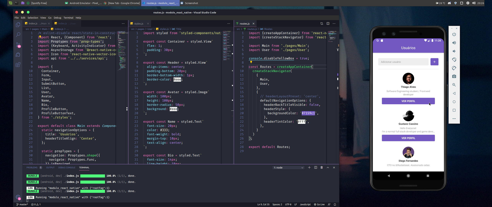
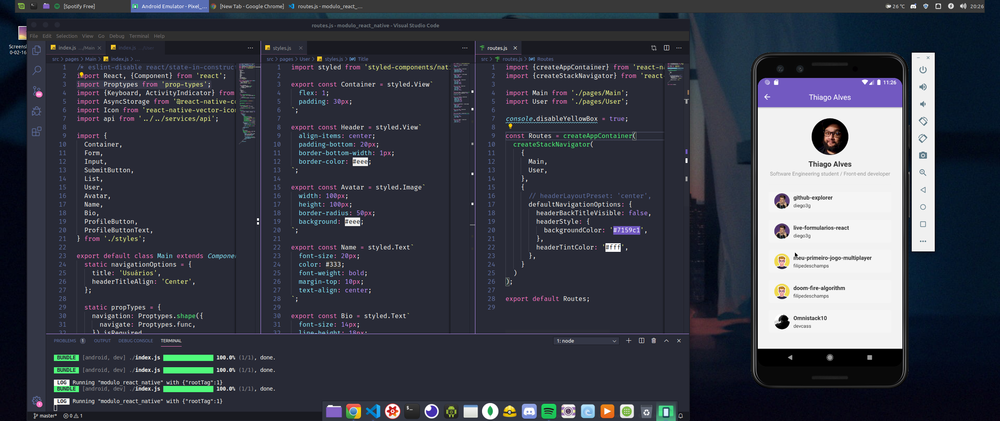
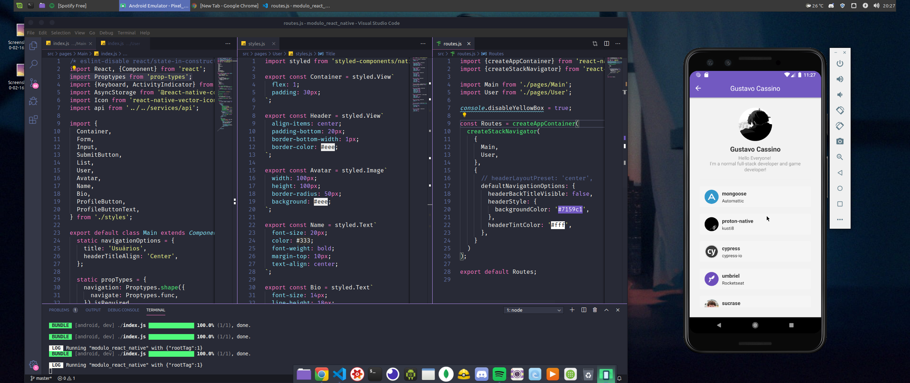

# Fase-03 -Primeiro Projeto React-Native

Desenvolvimento de aplicação mobile consumindo api do Github e listando usuários e seus repositórios favoritos.
Aplicação desenvolvida durante o Bootcamp GoStack da rocketseat

# Instalação: 

Faça download ou clone o repositório.

Dentro da pasta, abra o terminal e rode o comando "yarn".

Depois rode o comando  "react-native run-android" ou "react-native run-ios" e por fim, rode o comando yarn start.

Imagem da aplicação

 

 

 
